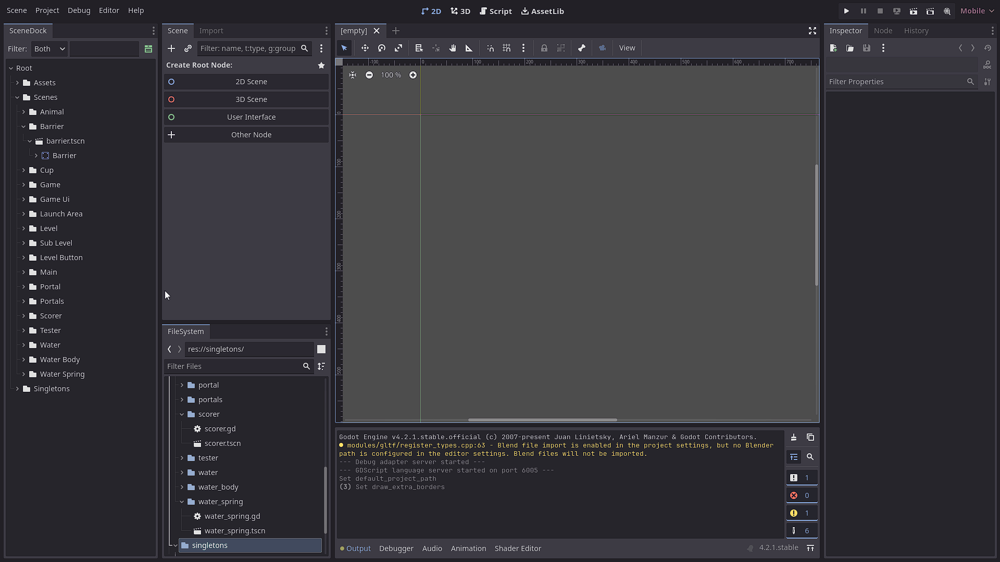

# A Scene Dock Plugin for Godot

This is a small plugin I wrote for personal use with Godot. I'm still relatively new to Godot, and I kept finding myself fighting with Godot's file explorer and scene panel. I wanted a way to navigate between scenes and scripts quickly.

More importantly, I wanted an easy way to see every place a Node was an instance of a scene. While my projects so far have been small, this is a huge help in larger projects where instanced nodes are used in several scenes at once.

I learned so much about how Godot is structured while writing this, as an example, Godot itself is made in Godot. The scene dock itself is made up of Godot nodes, and uses .gd script files for functionality! 

## Features
- Quickly navigate between scenes and scripts by double-clicking on them in the dock, if they are open in the editor they will be focused.
- Single click opens the scene or script in the inspector instead.
- Filter by name or node type.
- See every place a node is instanced in a scene.
- A setting to view folders as complete paths, not just the folder name.
- View your addons scenes and nodes, this was helpful for me while developing this plugin itself. (disabled by default)

## Installation
1. Simply download the repository and place the `scene_tree_viewer` folder in your `addons` folder.

I may try to publish this to the Godot Asset Library at some point, but I want to use it for a while and see if I can add any more polish to it first.